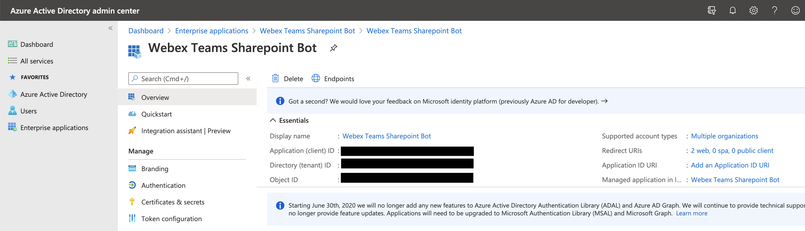
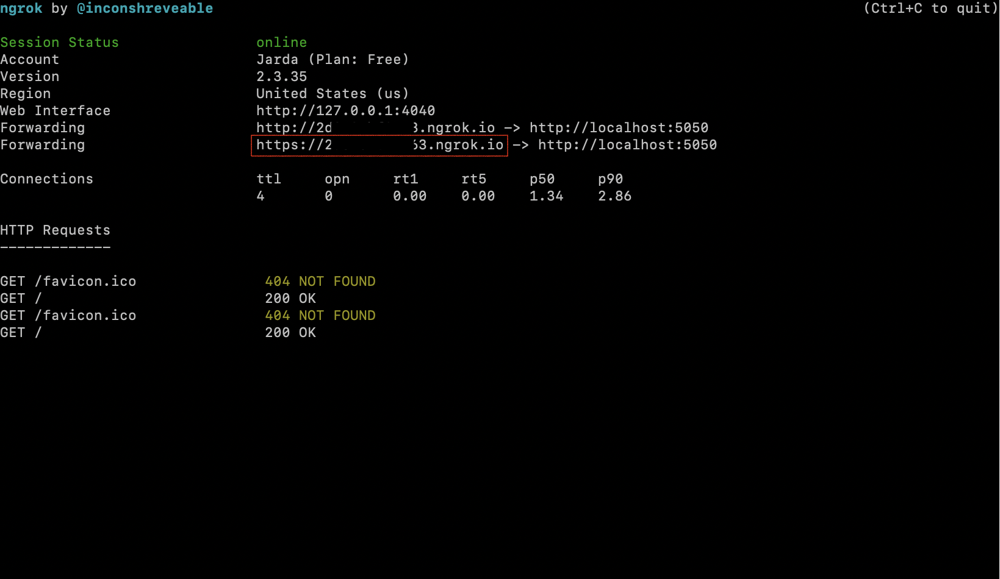
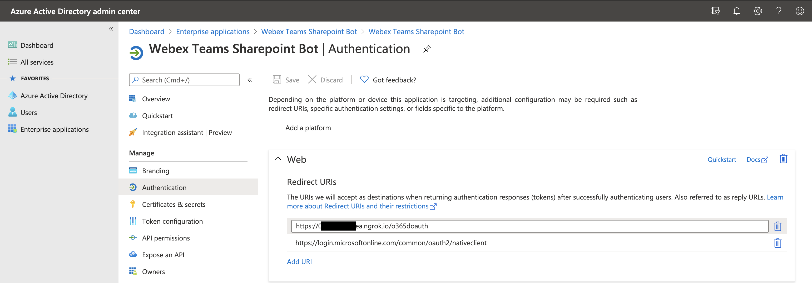
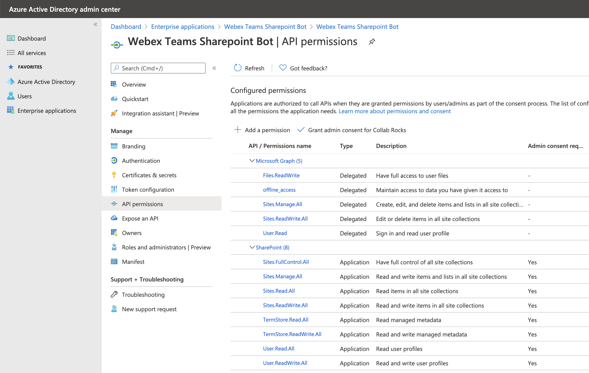
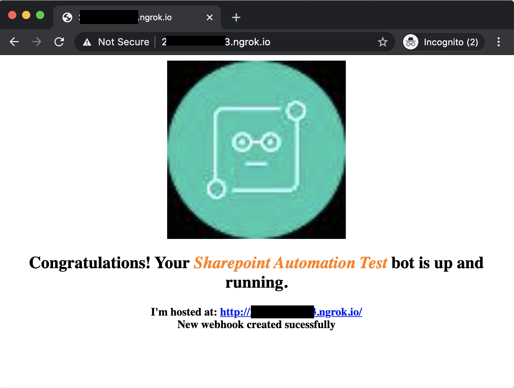
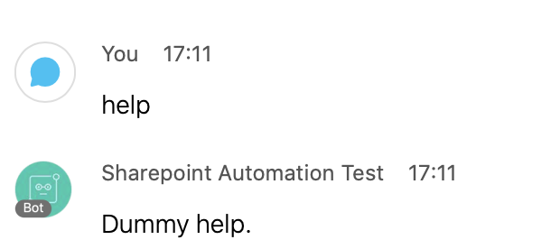
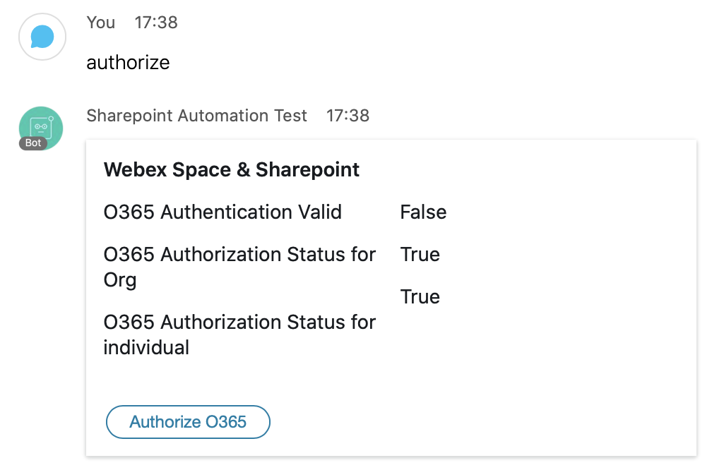
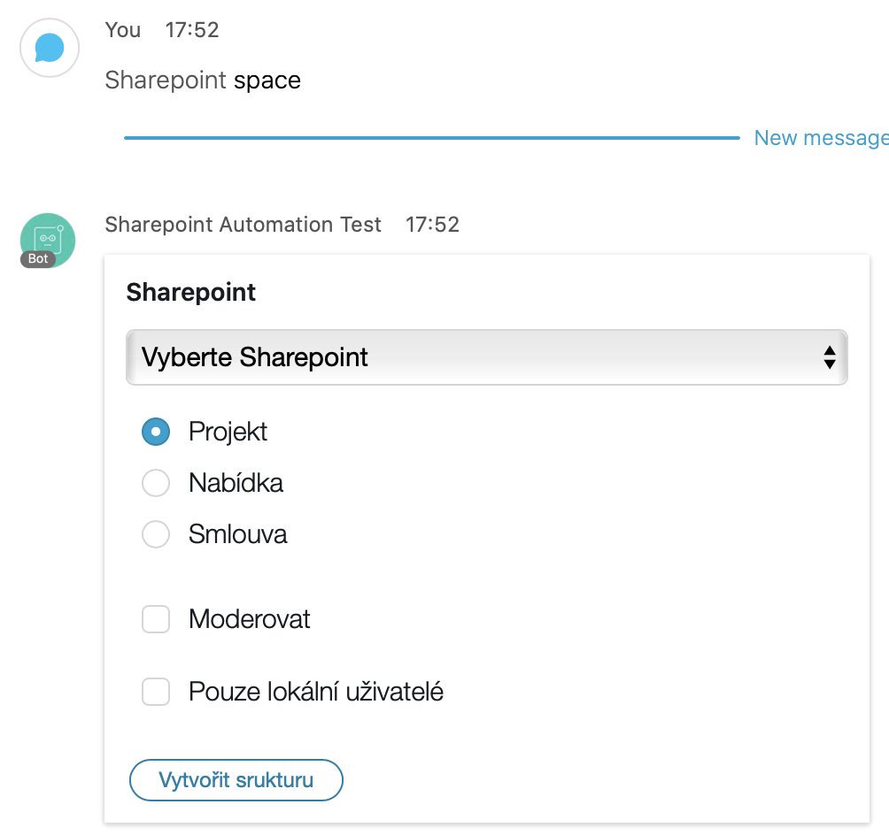
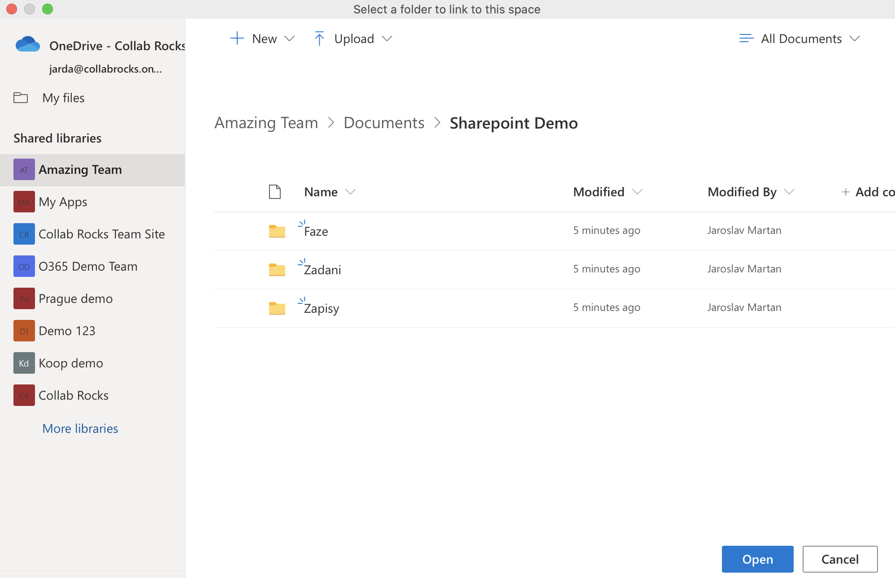
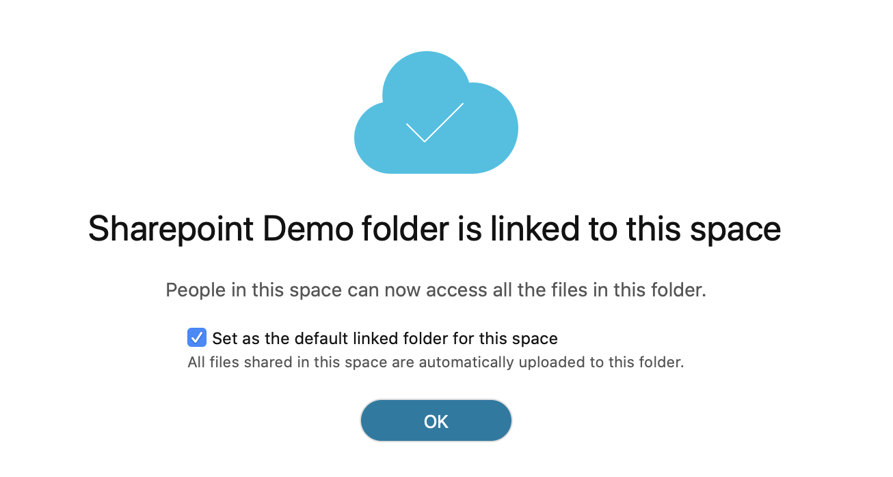

The Sharepoint automation Bot is designed to run in Amazon Lambda. It's using DynamoDB to store its data and runs in Flask. In development mode it can run locally as DynamoDB is provided as a Docker container and Flask can be started in development mode.

## Installing & running locally
### Requirements:
* Docker installed
* NGROK account and software installed

### Installation / initialization steps:
1. initialize virtual environment `python3 -m venv venv`
2. switch to virtual environment `source venv/bin/activate`
3. install required packages `pip install -r requirements.txt`
4. start local DynamoDB `docker run -p 8000:8000 amazon/dynamodb-local`
5. start NGROK, forward HTTP to local port 5050 `ngrok http 5050`
6. create a Webex Teams Bot at https://developer.webex.com/my-apps/new, get Bot ID and Access Token
7. copy `.env_sample` to `.env_local`, paste Bot ID to `BOT_ID` and Access Token to `WEBEX_TEAMS_ACCESS_TOKEN`
8. create a Office365 application in Azure AD administration, get Application ID, Object ID and Tenant ID

9. in **Authentication** add Redirect URI. Use a HTTPS URL generated by NGROK and add **/o365doauth** at the end.

10. create Client Secret for the O365 application in **Certificates & Secrets**
11. save the O365 Application ID, Object ID, Tenant ID and Secret into the respective variables in `.env_local`
12. set application Permissions (scopes) in **API Permissions**. Use all available for **Microsoft Graph** and **Sharepoint**.

13. start the Bot `dotenv -f .env_local run python sharepoint_bot.py`

### Test the Bot
Use a web browser to open HTTP URL generated by NGROK. If all goes well, the request will create webhooks for the Bot and respond with the page:

**Run the request every time you start the Bot.** The Bot needs the URL not only to setup its webhooks but also to generate an O365 authorization URL.
#### Try 1-1 communication
Open a 1-1 communication with the Bot. Send a **help** message. Watch the activity in the terminal where the Bot is running. The Bot should respond with a message.

#### Authorize the Bot to use your O365 account
Send **authorize** message to the Bot. The Bot should respond with a card showing the current authorization status.

Click the **Authorize O365** button. A web browser will open, enter your O365 credentials and confirm the scope. The bot will send a message that the authentication was successful. Check the authorization status again using the **authorize** message.
#### Create a Space with the Bot
Create a new Space or use existing Space. Add the Bot to it. Send a **space** message mentioning to the Bot. The Bot should respond with a card.

Select the Sharepoint site, set the options and click the button. The Bot will create a folder using the name of the space and create the selected folder structure in it.
Link the created Sharepoint folder to the Space using Webex Teams **Content->Link to Online Folder**. You may use the **Set as the default linked folder for this space** option to use the Folder as a primary storage for all documents shared in the Space.

#### Use Bot to synchronize folder access permissions
The users who were already in the Space will get their access granted to the Sharepoint folder. If you add or remove other users in the Webex Teams Space, their Sharepoint permissions will be granted or revoked.
